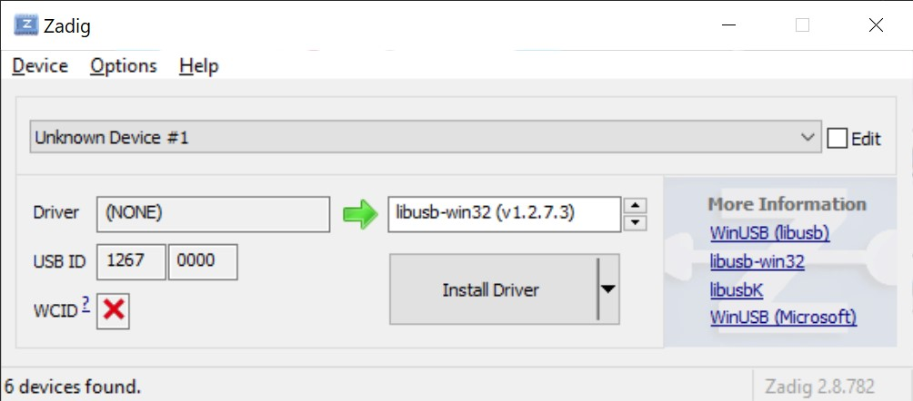

# USB Robot Arm Python Controller for Windows 10

This repo is a modified version of [python_usb_robot_arm](https://github.com/orionrobots/python_usb_robot_arm) by 
[orionrobots](https://github.com/orionrobots), tailored towards Windows 10.


## Requirements
- OS: Windows
- `libusb-win32` package
- Python 3.9
  - `pyusb` library (for USB robot control)
  - `flask` library (optional, for remote control)


## Installation Guide
1. Download the [**libusb-win32**](https://sourceforge.net/projects/libusb-win32/files/libusb-win32-releases/) package. 
2. Run the installation wizard. Installing the package in the default folder is acceptable.
3. Plug the robot into your computer via USB.
4. Download and run the most recent version of [**Zadig**](https://zadig.akeo.ie/).
5. Select the robot device. It may be listed as "Unknown Device #1". Ensure that it is the robot by checking 
that the **USB ID** displays 1267 and 0000 (as the Vendor ID and Product ID respectively). 
6. Choose "libusb-win32" as the driver to be installed. 
7. Click "Install Driver". The installation may take a couple of minutes.
8. Install the `pyusb` library. Installing through pip is suffice: `pip install pyusb`
9. Run [`test_connection.py`](test_connection.py) to check that the connection works. The light on the robot should 
flash five times.

## Usage
As a library:

    >>> import usb_arm

To initialise the USB connection and the arm itself:

    >>> arm = usb_arm.Arm()

The initialization will throw an exception if it fails to find the arm and connect to it. If no errors occur, then 
all the dependencies are working as expected. 

### LED
Now lets test it by turning on the LED.

    >>> arm.blink()

This will blink the LED five times.

The above three lines have been put together in [`test_connection.py`](test_connection.py) for you to test.
```python
import usb_arm
arm = usb_arm.Arm()
arm.blink()
```

The two LED commands are as follows:
- `arm.led.on()`
- `arm.led.off()`

The commands take in one optional argument: the duration time in seconds.


### Movement
The following list consists of all single movement commands:
- `arm.grippers.open()`
- `arm.grippers.close()`
- `arm.wrist.up()`
- `arm.wrist.down()`
- `arm.elbow.up()`
- `arm.elbow.down()`
- `arm.shoulder.up()`
- `arm.shoulder.down()`
- `arm.base.cw()`
- `arm.base.ccw()`

And if needed, 
- `arm.stop()`

The commands all take in one optional argument: the duration time in seconds.

### Combining Commands
A callable can be created by performing a bit-wise OR operator on two or more commands.

    >>> custom_combo = arm.shoulder.up | arm.wrist.down
    >>> custom_combo(3)  # perform combined command for 3 seconds

This can also be executed in one line:

    >>> (arm.shoulder.up | arm.wrist.down)(3)

Unfortunately, due to the limited amount of current in the system, the arm may not be able to perform two or more 
commands at the same time.


## Related Work

* The [original reverse engineering](http://notbrainsurgery.livejournal.com/38622.html) of the USB protocol was 
done by [Vadim Zaliva](http://www.crocodile.org/lord/).
* The [original code](https://github.com/orionrobots/python_usb_robot_arm) that this repo is based off of.
* [PCB scans](https://kyllikki.github.io/EdgeRobotArm/).

